<!--
  Profile README for github.com/Shubham-Patel07

  Every remote image below was checked and returns 200. These are deliberately
  EXCLUDED because they are broken as of 2026-08-14 — the previous version of this
  README embedded the Heroku ones, which is why it showed broken images for years:
    - *.herokuapp.com (streak, activity)   dead since Heroku killed free dynos
    - github-readme-stats.vercel.app       503 on repeated attempts
    - github-profile-trophy.vercel.app     402 Payment Required
-->

 

---

> [!NOTE]
> **Currently:** M.Tech CSE at NIT Warangal · **Previously:** Software Engineer at Nasdaq
> **Based in** India · IST (UTC+5:30) · open to opportunities

 

## 🧭 About

I build backend systems and the infrastructure they run on. Most of what I know came
from the gap between those two things — a service that looks correct in review behaves
differently at 3am with a dependency degraded and a queue backing up.

That's the thread through my work: **designing systems that fail narrowly instead of all
at once**, and building the observability to see it happening. Timeouts, circuit breakers,
error budgets and reproducible infrastructure aren't separate specialities to me — they're
the difference between software that works and software that keeps working.

 

## 🗓️ Timeline

<!--
  Self-contained animated SVG: types itself out line by line, in Geist Mono
  (inlined as base64 so it never depends on the viewer having the font) with the
  site's own palette. Mirrors the Terminal component in the hero.

  Animation is pure CSS @keyframes — no <script>, which is what browsers block in
  -embedded SVG. Verified: it animates via , exactly how GitHub embeds it.

  Fail-visible by design: the hidden state lives in the keyframe's `from`, not as a
  static clip-path, so a renderer that ignores CSS shows the FULL timeline rather
  than an empty terminal. Verified by stripping the <style> block and re-rendering.

  Generated from the timeline data behind shubhampatelv3.vercel.app/about;
  regenerate and re-commit the SVG when those entries change.
-->

  

 

## ⚡ Stack

 

<b>See the full breakdown</b>

 

| Area | Tools |
| --- | --- |
| **Languages** | Java · Python · Go · Bash · SQL |
| **Backend & Systems** | Spring Boot · REST APIs · Microservices · Distributed Systems · System Design · Databases |
| **Cloud & Infra** | AWS · Kubernetes · Docker · OpenShift · Terraform · Linux |
| **DevOps & CI/CD** | Jenkins · GitLab CI · GitHub Actions · Helm · IaC |
| **Observability & SRE** | Prometheus · Grafana · ELK / Kibana · Alertmanager · CloudWatch · SLIs / SLOs |

 

## 📈 Activity

  

 

## 🛰️ Live

I built a dashboard on my own site that pulls this straight from the GitHub API, rather
than embedding a third-party image that can rot:

<table>
<tr>
<td width="25%" align="center">

### 📊
**[Dashboard](https://shubhampatelv3.vercel.app/dashboard)**

Live stats &
contribution graph

</td>
<td width="25%" align="center">

### 🔀
**[Contributions](https://shubhampatelv3.vercel.app/contributions)**

PRs to other
people's projects

</td>
<td width="25%" align="center">

### 🧩
**[Case studies](https://shubhampatelv3.vercel.app/projects)**

Problem, architecture,
tradeoffs

</td>
<td width="25%" align="center">

### ✍️
**[Writing](https://shubhampatelv3.vercel.app/writing)**

Notes on systems
and operability

</td>
</tr>
</table>

 

### 💬 Let's talk

Open to opportunities and interesting problems in backend, systems and cloud engineering.

